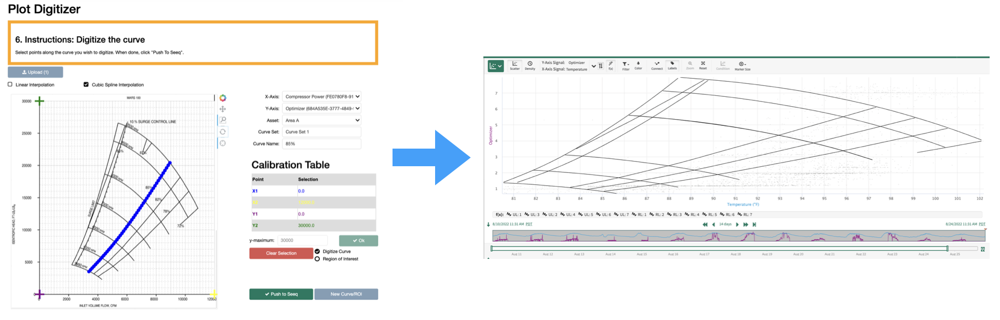
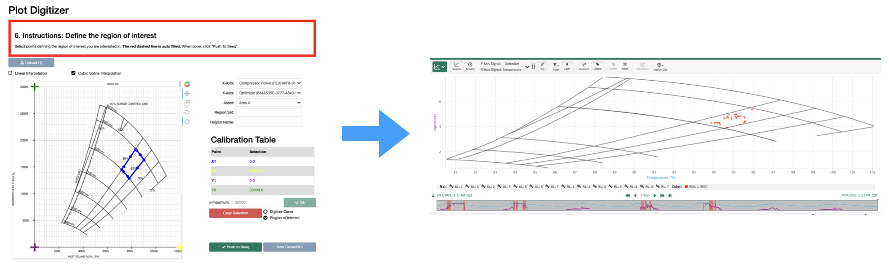
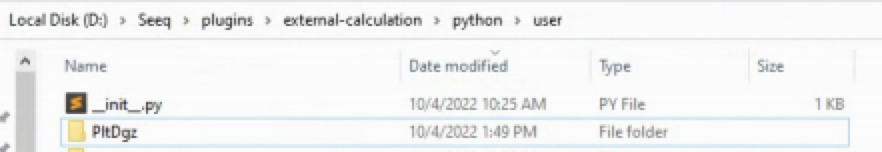
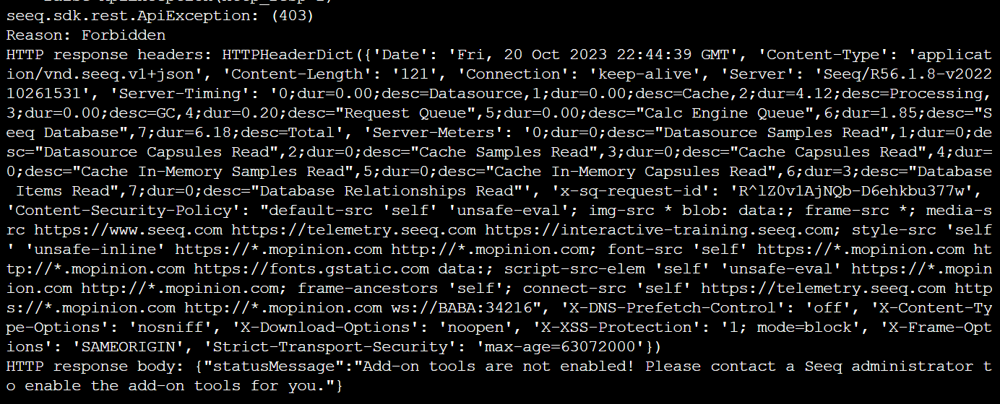

# seeq-plot-digitizer
Digitization tools for Seeq

1. [User Guide](#user-guide)
2. [Installation](#user-installation-seeq-data-lab)

## User Guide

Seeq Plot Digitizer is an addon tool designed to **streamline digitization of existing design documents in paper form**.

The Plot Digitizer tool can also be used to **define a region of interest (ROI)**, resulting in creation of a new condition in Workbench.

## User Installation (Seeq Data Lab)

The latest build of the project can be found [here](https://pypi.org/project/seeq-plot-digitizer/) as a wheel file. The
file is published as a courtesy to the user, and it does not imply any obligation for support from the publisher.

**Requires 62 > Seeq >= R62** (Note that this is the release the current v0.5.1 release was tested with.  Other Seeq releases have not been validated.)

1. Install the required external calculation scripts. 

    a. Manually download the [Plot Digitizer repository](https://github.com/seeq12/seeq-plot-digitizer). To do so, click the green `Code` button, then Download ZIP

	

    b. **Unzip** repository after downloading

    c. Open the `external_calculation` (*i.e.*, `seeq-plot-digitizer/external_calculation`) folder from the repository you just downloaded.

    d. **Move** (copy and paste) the `PltDgz` folder **and its contents** to the `python/user` external calculation folder on the remote agent or local machine where Seeq server is running (the external calculation folder is typically `C:/Seeq/plugins/external-calculation/python/user/` (Seeq R56), `C:/Seeq/add-ons/calculations/python/user/` (Seeq R62), or similar).

	

    **Very Important!** Once the `PltDgz` folder is created, be sure to never delete it. If you wish to make changes to the scripts contained therein, be sure to change the scripts themselves, never deleting, nor changing the name of the `PltDgz` folder!  

2. Create a **new** Seeq Data Lab project and open the **Terminal** window

3. (In SDL Terminal) Run `pip install seeq-plot-digitizer`

4. (In SDL Terminal) Run `python -m seeq.addons.plot_digitizer [--users <users_list> --groups <groups_list>]`. Then follow the prompt.

**NOTE** This install requires that addons be enabled in Seeq.  Please be sure to enable addons in the Seeq Administration page.  If not enabled an error like the following will occur. 

## Issue Tracker

Any issues can be [tracked here](https://github.com/seeq12/seeq-plot-digitizer/issues)
