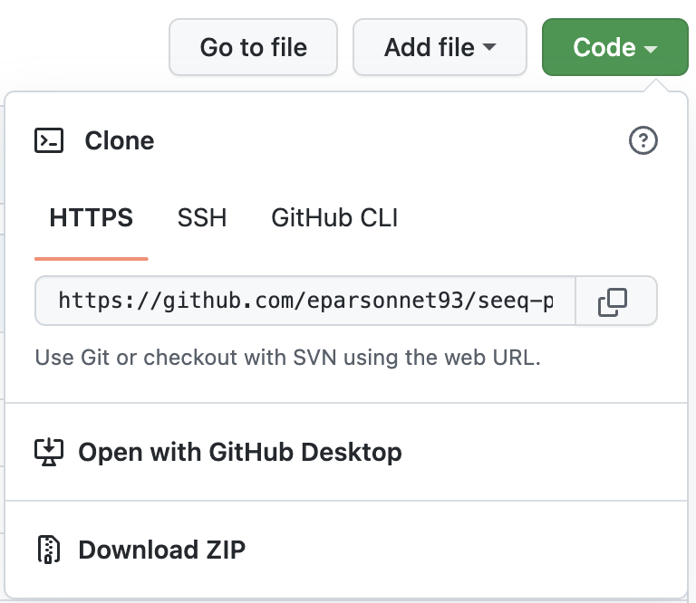
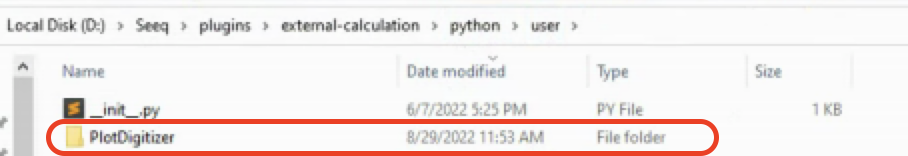

(install)=
# Installing Plot Digitizer

The latest build of the project can be found [here](https://pypi.org/project/seeq-plot-digitizer/) as a wheel file. The
file is published as a courtesy to the user, and it does not imply any obligation for support from the publisher.

**Requires Seeq >= R56**

1. Install the required external calculation scripts. 

    a. Manually download the [Plot Digitizer repository](https://github.com/seeq12/seeq-plot-digitizer). To do so, click the green `Code` button, then Download ZIP

	

    b. **Unzip** repository after downloading

    c. Open the `external_calculation` (*i.e.*, `seeq-plot-digitizer/external_calculation`) folder from the repository you just downloaded.

    d. **Move** (or copy and paste) the `PltDgz` folder **and its contents** to the `python/user` external calculation folder on the machine where Seeq server is running, (this is typically `C:/Seeq/plugins/external-calculation/python/user/` or similar).

	

2. Create a **new** Seeq Data Lab project and open the **Terminal** window

3. (In SDL Terminal) Run `pip install seeq-plot-digitizer`

4. (In SDL Terminal) Run `python -m seeq.addons.plot_digitizer [--users <users_list> --groups <groups_list>]`. Then follow the prompt.
