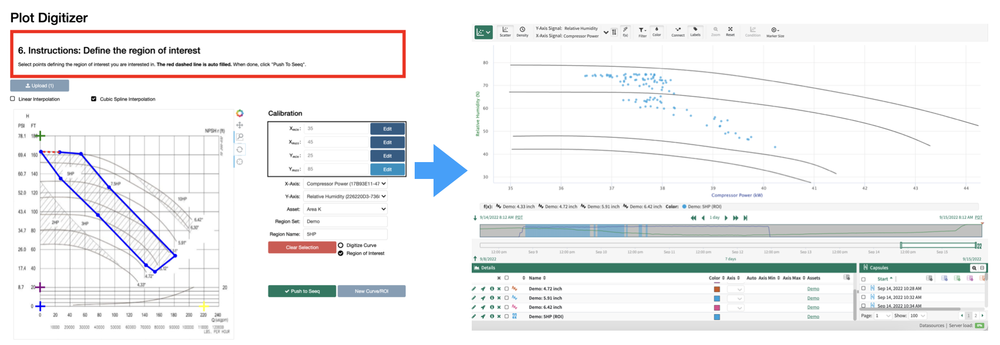

# Introduction to Plot Digitizer

**Plot Digitizer** helps to steamline analysis of data as it compares to theoretical or expected behavior, which is documented in paper or pdf form, by allowing the user to directly digitize curves from such design documents.  


Plot digitizer also allows the user to define "regions of interest" (ROIs), by selecting a region on the plot. Doing so will create a condition in [Seeq Workbench](https://www.seeq.com/product/workbench), selecting for data points that fall within the region. Plot digitizer seemlessly integrates with Seeq, creating sets of curves (formulas) and regions of interest (conditions) scoped to a parent asset. 




Customer facilities contain many pieces of equipment with Original Equipment Manufacturer (OEM) design data documented in paper or pdf form.  One common type of data are design curves, which guarantee the performance of one or more parameters as they relate to another.

A common example are pump and compressor curves.  They usually compare a rotating equipment’s throughput to the expected head (pressure), efficiency, and power.  It is in the interest of the operating facility to keep equipment running within a certain region of the curve, as this can directly impact equipment reliability and power consumption.  Comparing equipment operation against design curves also allows engineers to assess losses in efficiency to justify either design changes or equipment overhaul.  This drives business decisions ranging from optimizing facilities to justifying capital investment. By obtaining a digital version of a design curve and overlaying it with data both in trend and XY plot, users can perform such analyses directly in Seeq.  Furthermore, by using conditions to identify periods of poor performance, one can easily help quantify the impact of off-design performance.

Once design curve data data are in Seeq, the actual opportunity to extract value begins.  Some examples of analyses that could be leveraged in the rotating equipment space:

1. Identify operation off design

    a. Is it worth considering an equipment redesign

    b. Quantify losses due to losses off-design to justify capital

    c. Exception based monitoring for fleet of assets

2. Compare actual efficiency to OEM efficiency for each operating point

    a. Drive maintenance planning and prioritization

3. Overlay curves with operating data to compare performance/efficiency gains of a new design curve to existing operation

    a. Helps justify investment into design tweaks or changes

4. Use tools like clustering to identify regions of operation that require investigation and auto-generate capsules for those periods of interest


The Plot Digitizer tool allows users to first calibrate axes and then pick points along an image to create a digital copy of a design curve (or region of interest).  The result is then pushed to a Seeq asset for use in monitoring and analysis.

## Plot Digitizer Terminology

- **Digitized Curve**: The formula in Seeq resulting from  digitization of a curve using the Plot Digitizer addon.
- **Region of Interest**: The condition in Seeq resulting from a region of interest definition using the Plot Digitzer tool.
- **Plot Image**: A `.png` file of the plot that the user wishes to digitize.
- **Curve Set (Region Set)**: A name given to a family of curves (or regions of interest). See {ref}`asset-hierarchy`
- **Curve Name (Region Name)**: A name give to a single digitized curve (or region or interest). See {ref}`asset-hierarchy`

(asset-hierarchy)=
### Asset hierarchy

```
Parent Asset
│   Signal 1 (x-axis)
│   Signal 2 (y-axis)
│
└───Curve Set 1
│   │   My Curve 1
│   │   My Curve 2
│   
└───Region Set 1
    │   My Region 1
```
  
