(userguide)=
# Plot Digitizer User Guide

Seeq Plot Digitizer is an addon tool designed to **streamline digitization of existing design documents in paper form**.

The Plot Digitizer tool can also be used to **define a region of interest (ROI)**, resulting in creation of a new condition in Workbench.

## Prepare the Plot you wish to digitize

- Retrieve a `.png` file of the plot you wish to digitize. For example purposes we will use a plot of relative humidity vs. Temperature for various wet bulb temperatures:

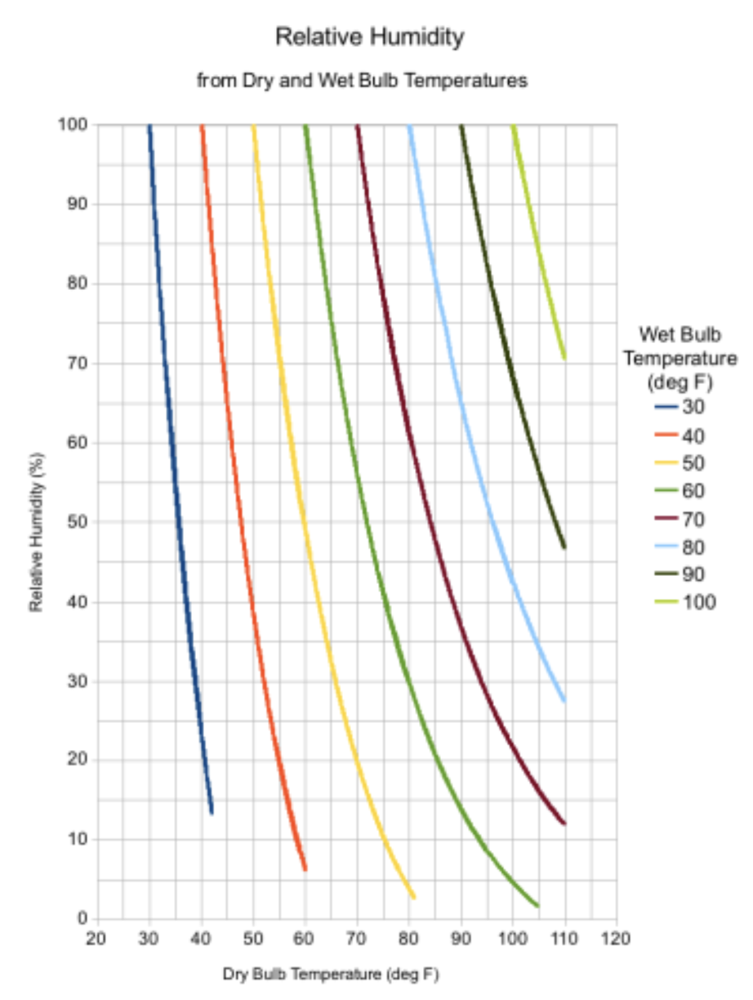

## Prepare in your workbook

- Add at least two signals. One signal should correspond to the x-axis of the plot image (which you wish to digitize) and the other should correspond to the y-axis. In this case we add Temperature for X and Relative Humidity for Y:

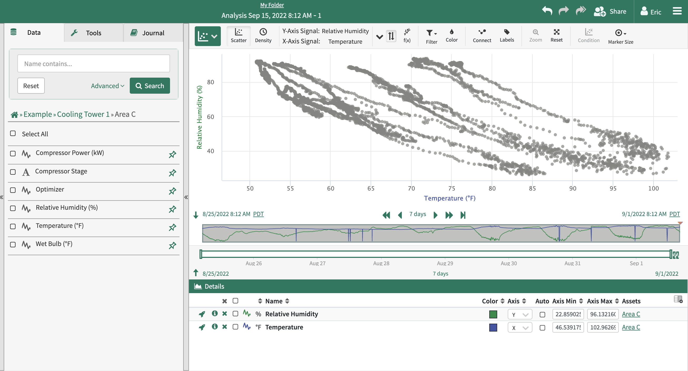

## Plot Digitization

1. Open the **Plot Digitizer** Tool in the addon panel

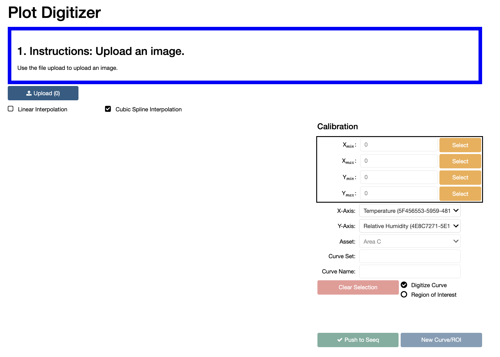

2. Upload your image using the image upload button. After completion, your image will appear in the tool

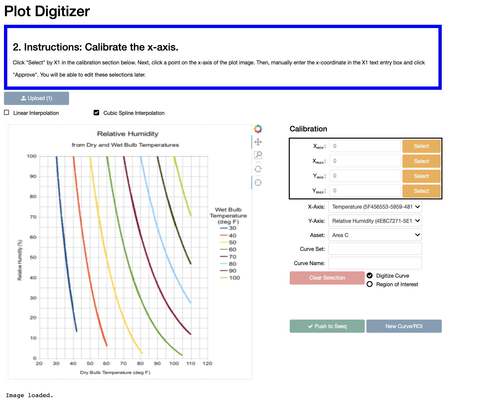

3. Following the instructions listed in the instruction box, calibrate the axis. This is achieved by first clicking `Select` for one of the four calibration points (x_min, x_max, y_min, y_max), then clicking on the relavant point on the plot image. Once you have selected a calibration point, enter its value and click `Approve`. 

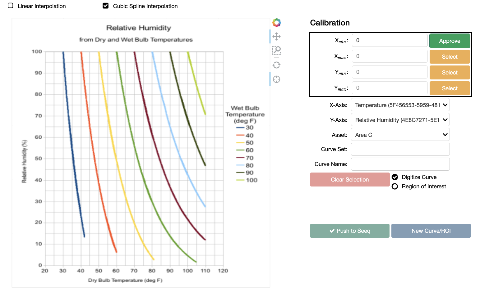

- **Note**, to assist in precision clicking, you can use the zoom tool on the plot image, by selecting it and then clicking and dragging over a region you wish to zoom in on. 

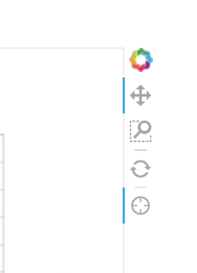

- Once all four calibration points have been selected, you are ready to digitize the curve. You can edit calibration points later by clicking `Edit`. 

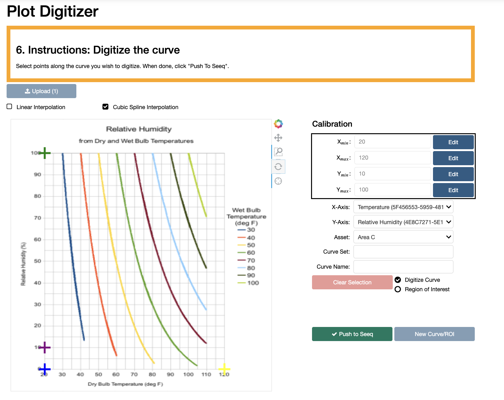

4. **Digitize the Curve** by clicking directly on the curve of your choosing. Zooming in on it (using the toolbar) may assist with precision. 

- You can choose from either cubic spline interpolation, or linear interpolation. Cubic spline will smooth corners, while linear will result in a set of piecewise linear curves. 

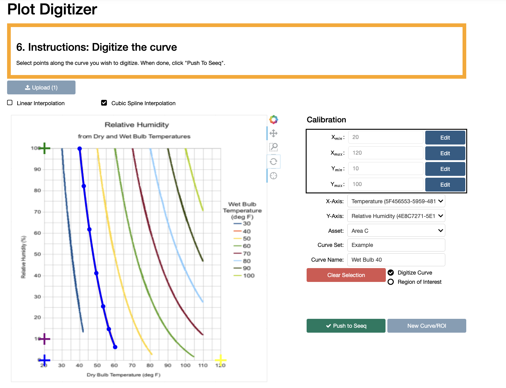

5. Set X and Y axis signals, choose the parent Asset to which to scope the resulting digitized curves, enter a Curve Set Name and Curve Name, and click `Push to Seeq`. 

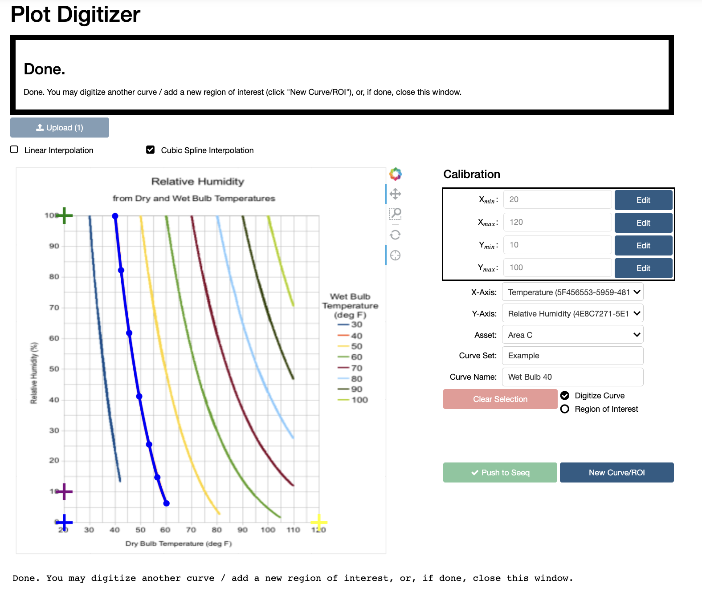

- Once you have finished, you may digitize another curve (or region of interest by selecting the `Region of Interest` radio button) by selecting `New Curve/ROI`, or simply close the window if you are finished.

- The results will now appear in your workbook. Here I show the results if digitizing the curve corresponding to a wet bulb of 40 and 70:

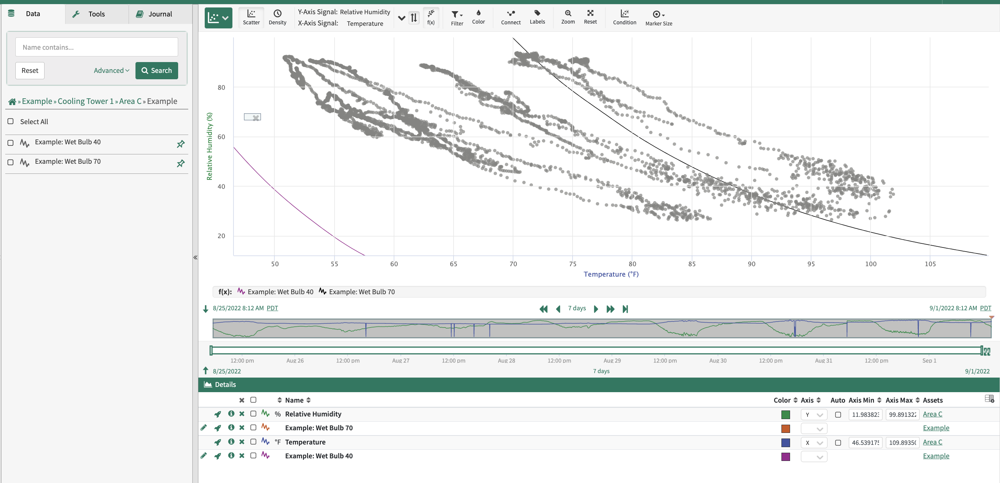

## Region of Interest

1. After calibrating axes, select the radio button `Region of Interest`. Define a region by clicking on the plot image (**the red dashed line is auto-completed, you do not need to complete loop**). After specifying a region set name and region name, click to `Push to Seeq`.

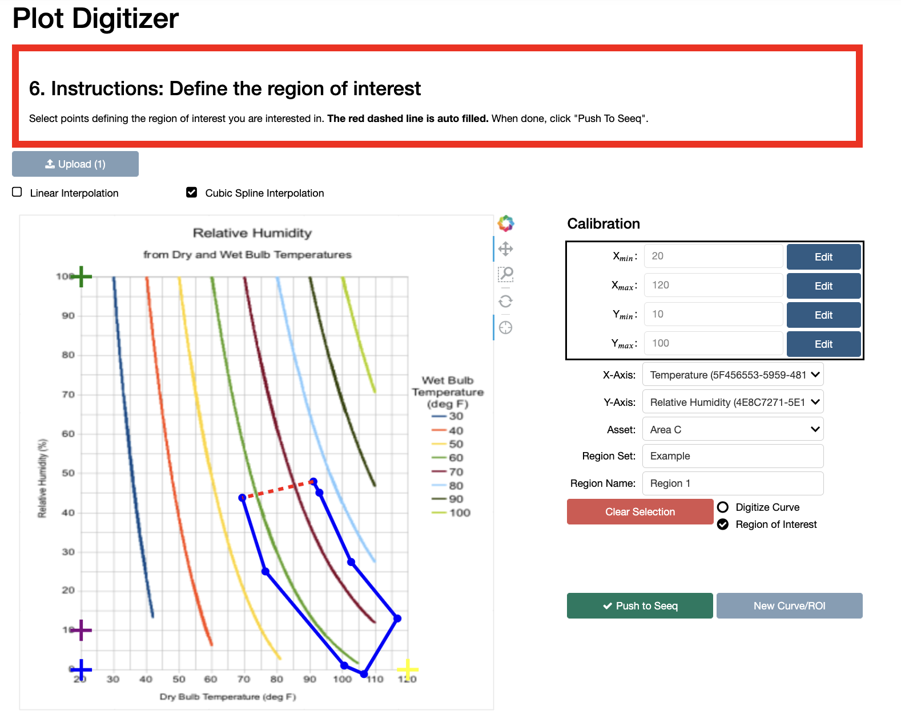

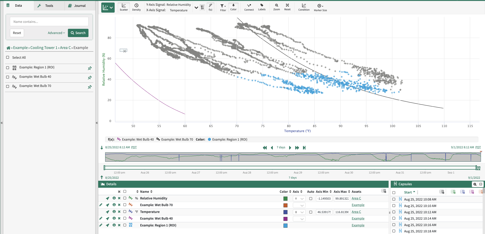

